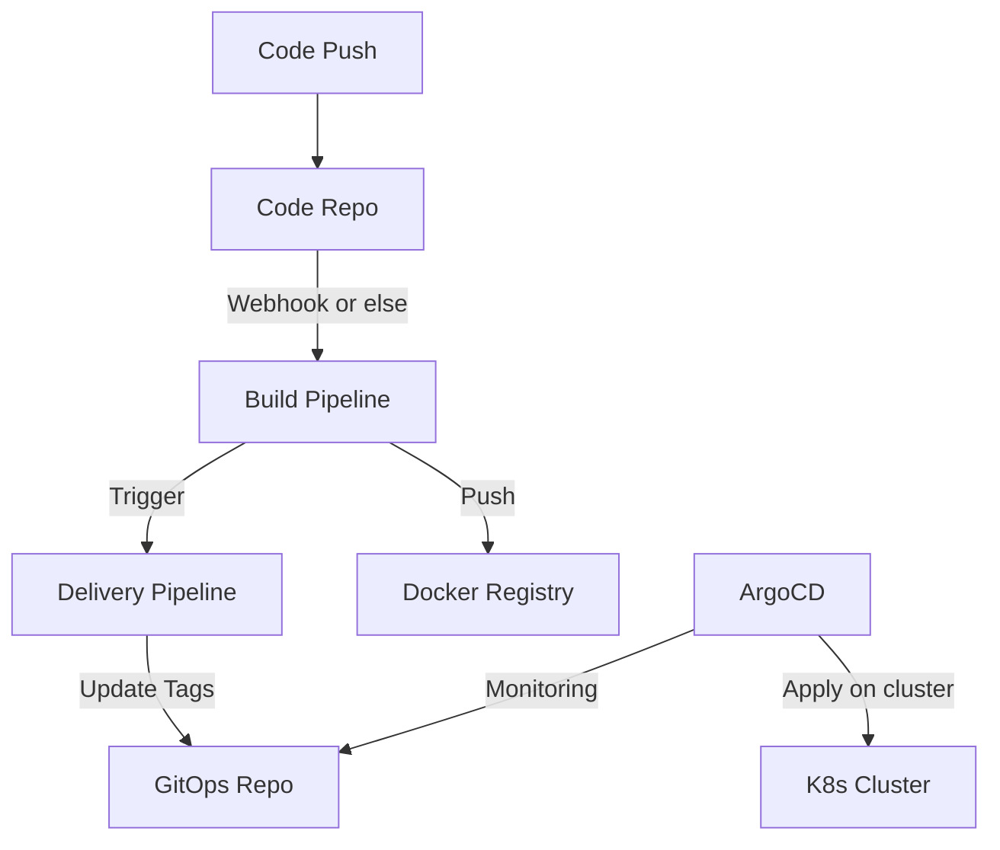
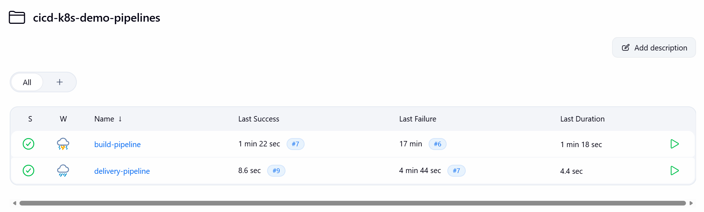
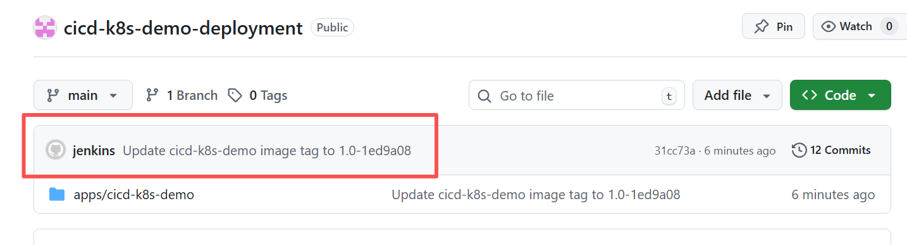
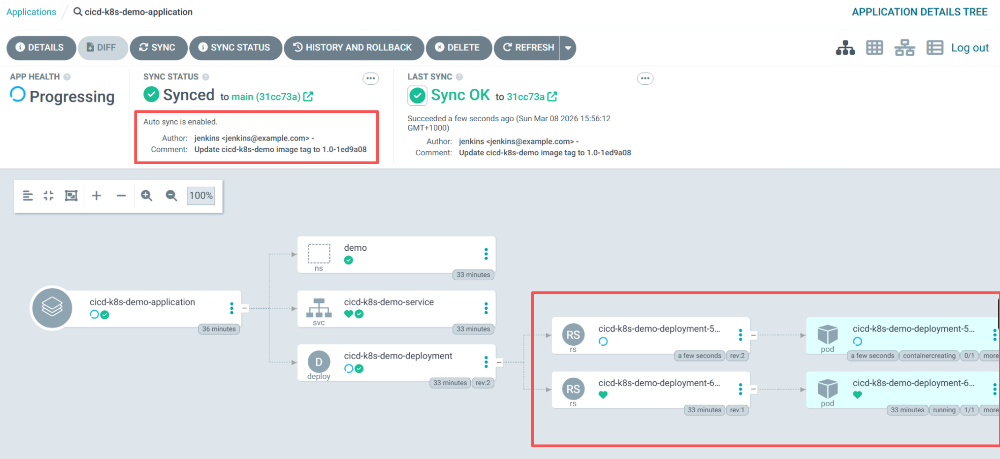
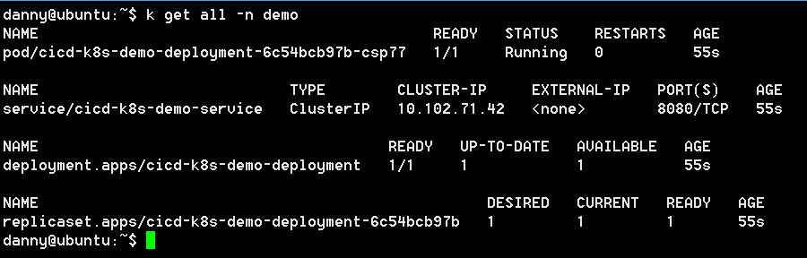

## CI/CD Demo with K8s

### Description
This is a simple project providing a minimal files to implements CI/CD and GitOpts 
with tools such as Jenkins/GitAction, K8s, Argocd, or Helm (later on).

Feel free to try CI/CD with this repo on your on own.

Linked [GitOps-repo](https://github.com/dannyyyyS/cicd-k8s-demo-deployment.git)

---

### Prerequisite
1. Have basic concepts about what CI/CD and GitOpts
2. Have tools installed yet: Jenkins/GitAction, Argocd, K8s  
_In my case, I use Minikube for K8s practice, Jenkins running inside docker, Argocd running upon Minikube_

---

### Directories

| DIR               | usage                              |
|-------------------|------------------------------------|
| /src/** & pom.xml | Simple Spring boot project         |
| Dockerfile        | Define how Docker image been built |
| Jenkinsfile       | Build pipeline definition in SCM   |

---

### Simple CI/CD flow...

#### What build pipeline dos
- build java spring boot project into a jar
- build Docker image according Dockerfile
- push image to docker registry
- trigger delivery pipeline

#### What delivery pipeline dos
- get build tags from build pipeline
- fetch GitOps repo then update image version in target files
- push to GitOps repo

#### What Argocd dos
- continuous monitoring changes on GitOps repo  
  _notice: specific directory hierarchy required_
- once changes detected, apply changes on K8s cluster

---

### Steps (Jenkins version)
#### Step1: Create build pipeline
1. Check out "Pipeline script from SCM"  
_which means that use [Jenkinsfile](https://github.com/dannyyyyS/cicd-k8s-demo/blob/master/Jenkinsfile) in the repository, and pipeline definition is all inside Jenkinsfile_  
**_remember to modify the files before using, and create docker-hub/git credential in advance_**
2. Populate require information
_don't forget to confirm Jenkinsfile path_

#### Step2: Create delivery pipeline (use [GitOps-repo](https://github.com/dannyyyyS/cicd-k8s-demo-deployment.git))
1. Check out "Pipeline script from SCM"  
[Jenkinsfile](https://github.com/dannyyyyS/cicd-k8s-demo-deployment/blob/main/apps/cicd-k8s-demo/Jenkinsfile) here

2. Populate require information  
_don't forget to confirm Jenkinsfile path_

#### Step3: Trigger Build Pipeline manually or Configure webhook on git

---

### Some screenshots

#### Pipeline overviews

#### Jenkins Push tags to GitOps repo after build pipeline  

#### Argocd applying changes on K8s cluster

#### k8s status check

---

### some alternatives

#### Cloud Solution
deploy by cloud-cli or terraform in pipeline, orchestrate pipeline/tools whatever you want
